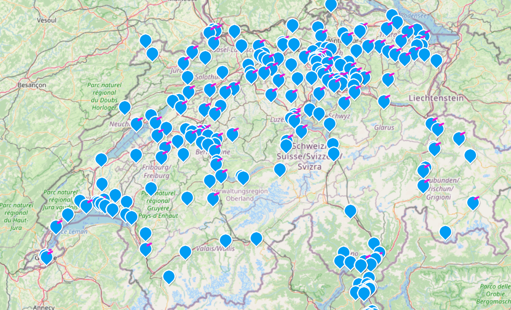
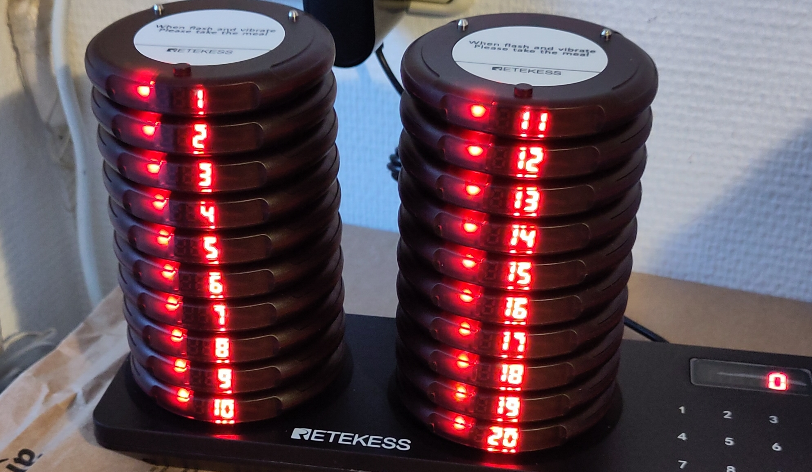

## what is a Repaircafe  

---

### by Jogi 

---

### Microcontroller Talks

1. **Jogi:** Introduction, history incl 6502, 80C166, via Arduino to Raspi Pico, [Code](https://github.com/jogi-k/micro-controller-slides/tree/gh-pages) and [Slides](https://jogi-k.github.io/micro-controller-slides) 
2. **Jogi:** MC-based learning-platforms, Micro:Bit & Calliope, [Code](https://github.com/jogi-k/micro-controllers-part2/tree/gh-pages) and [Slides](https://jogi-k.github.io/micro-controllers-part2)
3. **Felix:** ESP8266- and EPS32-Universe, [Felix](https://github.com/fliiiix), Lightning Talks-Repo 
4. **Jogi:** More Pi Pico, Environments, Comparison, Eco-System, [Code](https://github.com/jogi-k/micro-controllers-part4) and [Slides](https://jogi-k.github.io/micro-controllers-part4)
5. **Jogi:** usecase RLX-Testfarm, making use of [RubberJogi OSS](https://github.com/jogi-k/RubberJogi), Lightning Talks Repo

---

---

## Sometimes: Spare-Time 

* Working in a ["Maker-Space"](https://www.turbine-brunnen.ch)
* Member of the Board
* Responsible for IT, Webpage, etc
* Organizing Soldering-Events for Kids
* Programming-Courses for kids (see Micro-Controller-Talks II :-) ) 

---

---

---

## Sometimes: Spare-Time 

* ...
* ... and more ...
* and : Repair-Cafes 

---

## what is a Repaircafe ? 

---

## Rather easy concept

### We connect 

* People with defect objects 
* with 
* People doing repair as hobby and for free 

---

## Thanks

## Q & A 

---

# History of Repair Cafe

---

## First Repair Cafe

### Ever 

#### Sunday, 18-Oct-2009

#### Amsterdam / Netherlands

#### Oct 2024 : 15th Birthday

#### [Video 15 Years](https://www.youtube.com/watch?v=hV0nljoAyJk )

---

### Anouncement

---

### Martine Postma

---

### First Repair Cafe in Switzerland :  

* 2013: Roger Fleury from Thun saw Repair-Cafes in Netherlands 
* decided to organize something similiar at home. 
* being himself not a repair-guy, he did not find others
* idea was not suceessful
* In 2014 he was contacted by [Konsumentenschutz](https://www.konsumentenschutz.ch) 
* together : very first Repair Cafe in Switzerland
* In Thun on 16-Aug-2014 (around 200 visitors , 71 objects, 44 repaired) 
* [Source: Repair-Cafe Thun](https://repaircafe-thun.ch/die-geschichte/)

---

### First Repair Cafe in Brunnen

* The very first Repair-Cafe we organized in our [Maker-Space](http://www.turbine-brunnen.ch) 
* was on 20 Oct 2018   
* this was also the first birthday of our Maker-Space
* (we gifted ourselves a Laser-Cutter ...)

---

---

### already in 2019

---

## Since then

* Every year : 3 or 4 Repair Cafes
* Always saturdays
* Also during Corona-Pandemic
* Repairing with open windows
* Facemasks
* And the reception outside

---

---

### Innerschwyz

---

### Our Repair-Cafe

---

### Basel  

---

### Switzerland 

---

### St. Cugat / Barcelona  

---

### USA

---

---

# How ?

---

## Some principles everywhere

* Repair itself has to be free
* Repairer has to be volunteer
* No professionals 
* Material can be charged
* Cafe, Cake etc can be charged
* Guests are allowed to donate

---

## How it works I

* Guests come and bring their objects
* We have a lot of tools, but also:
* Repairers bring their tools
    * Some a pocket-knife 
    * some a car w/ electronic equipment
* While guests waiting: drink coffee, eat cake
* we try to limit the time to 30-40 mins

---

## How it works II

* Still best:
    * encourage guest to repair themselves
    * with help of repairer
* At least:
    * guests "have" to stay
    * Its **not** drop and come back later 
    * They need to tell the problem
    * And to say yes/no e.g. on opening/cracking ...

---

## Experimenting with structure I

* Introduced Repair-Evenening
    * For stuff where we had hope
    * but expected time >> 30-40 mins
    * or material was missing
    * some weeks later, w/o any guests, just nerds :-)

### Success, we kept that

---

## Experimenting with structure II

* Introduced two repair-queues 
    * One where the people were waiting 
    * One for people who didn't have time

### Fail !

---

## Why Fail ?

* Most guest did not know the basic principle
* We couldn't tell them how long to wait
* dropped their objects
* Repairers could not ask about the problem
* Repairers could not clarify when opening
* Unhappyness on all ends ... 

---

## Solution 

* Digitalised the process 
* Self-Registration of guests
* Registration-office operates Kanban-Board 
* Dashboard for guests with estimated waiting-time
* Kanban-Board for repairers
    * showing them the queue-length
    * "forcing" them to stop latest after 30-40 mins
* Web-based, [open-source](https://github.com/jogi-k/repaircafe) (Python, Flask, Bootstrap...)
* A lot of improvement-ideas ...

---

### The Dashboard

---

### The Kanban Board

---

### Next level :-)

---

# WHY ?

---

 

encourage guest to repair themselves
    * with help of repairer
* At least:
    * guests "have" to stay
    * Its **not** drop and come back later 
    * Idea is to to "learn"
    * And to say yes / no e.g. on opening ...

---

---

---

---

---

---

---

---

---

---

---

---

---

---

---

---

---

---

---

---

---

### Resources 

* This talk [git-repo sources (branch gh_pages)](https://github.com/jogi-k/lightning-talk-repaircafe/tree/gh-pages/)
* This talk [as slides on the web](https://jogi-k.github.io/lightning-talk-repaircafe/)

---

### The END 

