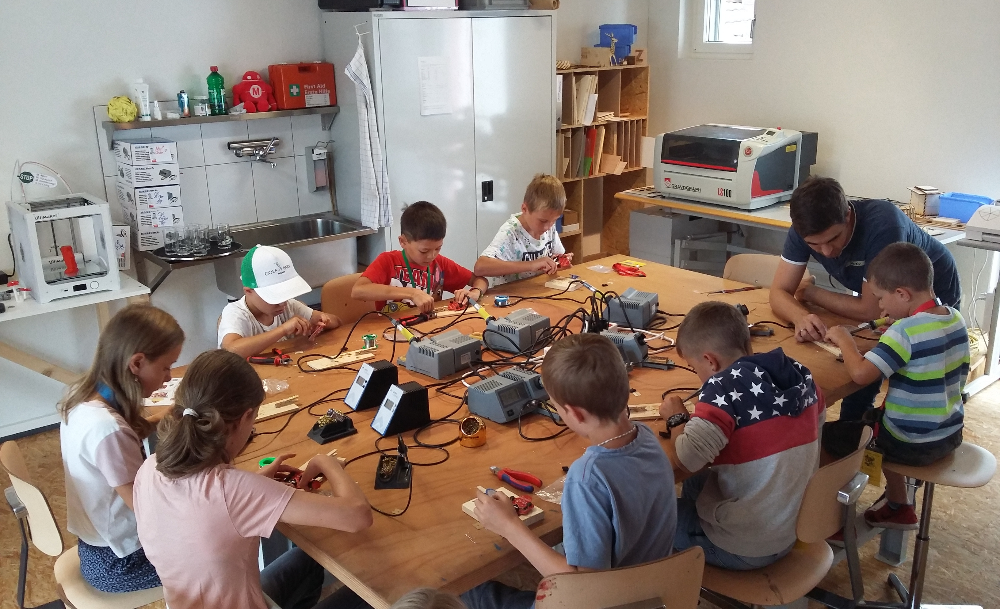

## what is a Repaircafe  

---

### by Jogi 

---

### Microcontroller Talks

1. **Jogi:** Introduction, history incl 6502, 80C166, via Arduino to Raspi Pico, [Code](https://github.com/jogi-k/micro-controller-slides/tree/gh-pages) and [Slides](https://jogi-k.github.io/micro-controller-slides) 
2. **Jogi:** MC-based learning-platforms, Micro:Bit & Calliope, [Code](https://github.com/jogi-k/micro-controllers-part2/tree/gh-pages) and [Slides](https://jogi-k.github.io/micro-controllers-part2)
3. **Felix:** ESP8266- and EPS32-Universe, [Felix](https://github.com/fliiiix), Lightning Talks-Repo 
4. **Jogi:** More Pi Pico, Environments, Comparison, Eco-System, [Code](https://github.com/jogi-k/micro-controllers-part4) and [Slides](https://jogi-k.github.io/micro-controllers-part4)
5. **Jogi:** usecase RLX-Testfarm, making use of [RubberJogi OSS](https://github.com/jogi-k/RubberJogi), Lightning Talks Repo

---

---

## Sometimes: Spare-Time 

* Working in a ["Maker-Space"](https://www.turbine-brunnen.ch)
* Member of the Board
* Responsible for IT, Webpage, etc
* Organizing Soldering-Events for Kids
* Programming-Courses for kids (see Micro-Controller-Talks II :-) ) 

---

---

---

## Sometimes: Spare-Time 

* ...
* ... and more ...
* and : Repair-Cafes 

---

## what is a Repaircafe ? 

---

## Rather easy concept

### We connect 

* People with defect objects 
* with 
* People doing repair as hobby and for free 

---

## Thanks

## Q & A 

---

## First Repair Cafe

### Ever 

#### Sunday, 18-Oct-2009

#### Amsterdam / Netherlands

#### [Video 15 Years](https://www.youtube.com/watch?v=hV0nljoAyJk )

---

### Anouncement

---

### Martine Postma

---
### First Repair Cafe in Switzerland :  

* A guy from Thun called Roger Fleury saw in 2013 the Repair-Cafes in the Netherlands 
* decided to organize something similiar at home. 
* being himself not a repair-guy he did not find others
* idea was not suceessful
* In 2014 he was contacted by the so called [Konsumentenschutz](https://www.konsumentenschutz.ch) 
* together they organized the very first Repair Cafe in Switzerland
* In Thun on 16-Aug-2014 (around 200 visitors , 71 objects, 44 repaired) 
* [Source: Repair-Cafe Thun](https://repaircafe-thun.ch/die-geschichte/)

---

### First Repair Cafe in Brunnen

* The very first Repair-Cafe we organized in our [Maker-Space](http://www.turbine-brunnen.ch) 
* was on 21. Oct 2018   
* was also the first birthday of our Maker-Space

---

## Todo

---

---

## Since then

* Every year 3 or 4 Repair Cafe
* Also during Corona-Pandemic
* Repairing with open windows
* Facemasks
* And the reception outside

---

---

## Our Repair-Cafe

---

## Innerschwyz

---

## Schweiz 

---

### Resources 

* this talk [git-repo (branch gh_pages)](https://github.com/jogi-k/micro-controllers-part4/tree/gh-pages)
* this talk [as slides](https://jogi-k.github.io/micro-controllers-part4)

---

### The END 

---

---

---

---

---

---

---

---

---

---

---

---

---

---

---

---

---

---

---

---

---

---

---

---

---

---

---

---

---

---

---

---

---

---

---

---

